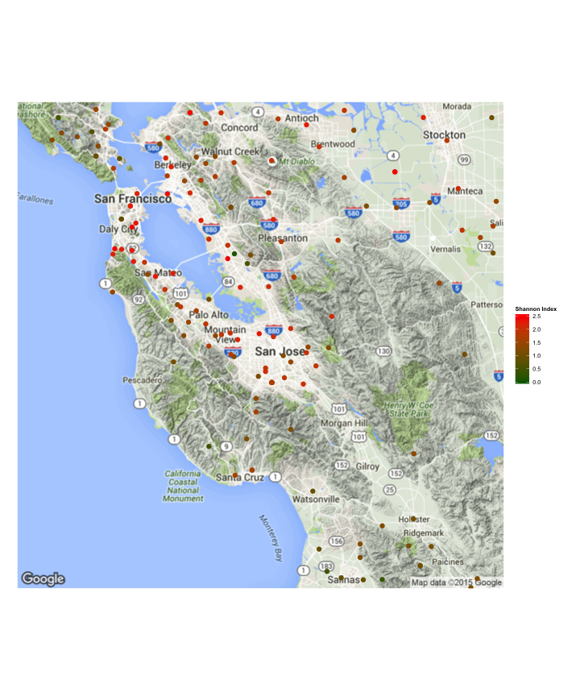

# Introduction


# Analysis

## Load needed libraries

These libraries are loaded.


```r
library(RCurl)
library(RJSONIO)
library(ggmap)
library(ggthemes)
```
## Download data files

```r
## Download 2013 Growth API file
download.file(url="http://www3.cde.ca.gov/researchfiles/api/api13gtx.zip",
              destfile="api13gtx.zip")
## Unzip it.
unzip(zipfile="api13gtx.zip")
```
## Prepare Record Layout file

The record layout is defined in http://www.cde.ca.gov/ta/ac/ap/reclayout13g.asp. I converted the HTML table to CSV file and saved it as record_def.csv. Most importantly, the file contains the field length which is needed to parse the fixed-width record format.


```r
record_def <- read.csv("record_def.csv", header=FALSE)
colnames(record_def) <- c("index",
                          "colname",
                          "type",
                          "fieldsize",
                          "description")

## Set some columns' class.
races <- c("AA", "AI", "AS", "FI", "HI", "PI", "WH", "MR")

numeric_column <-
    c("VALID",
      "API13",
      unlist(lapply(c("NUM", "API13"), function(score) paste(races, score, sep="_") ) ) )
character_column <- c("SNAME")

column_classes <- rbind(
    data.frame( colname=numeric_column, class="numeric", stringsAsFactors=FALSE),
    data.frame( colname=character_column, class="character", stringsAsFactors=FALSE))

record_definition_table <- merge(record_def,
                                 column_classes,
                                 by="colname",
                                 all=TRUE,
                                 sort=FALSE)

record_definition_table <- record_definition_table[order(record_definition_table$index),]
record_definition_table[which(is.na(record_definition_table$class)), "class"] <- "character"
```

## Load Data File


```r
api13gtx <- read.fwf("api13gtx.txt",
                     width=record_definition_table$fieldsize,
                     col.names=record_definition_table$colname,
                     colClasses=record_definition_table$class, comment.char="")

## Clean up NA
colnames_to_use_0_for_na <- c(paste(races, "NUM", sep="_"), "VALID")
for(colname in colnames_to_use_0_for_na) {
    api13gtx[is.na(api13gtx[,colname]), colname] <- 0
}

school <- api13gtx[api13gtx$RTYPE == "S",]
district <- api13gtx[api13gtx$RTYPE == "D",]
state <- api13gtx[api13gtx$RTYPE == "X",]
```

## Define Functions


```r
shannon.index <- function(populations) {
    populations <- as.numeric(populations)
    total <- sum(populations)
    ratio <- populations / total
    entropies <- sapply( ratio, function(p) {
        p * ifelse(p > 0, log(p, 2), 0)
    } )
    return(-sum( entropies ))
}

google_map_url <- function(address, return.call = "json", sensor = "false") {
  root <- "http://maps.google.com/maps/api/geocode/"
  u <- paste(root, return.call, "?address=", address, "&sensor=", sensor, sep = "")
  return(URLencode(u))
}

geo_code <- function(address,verbose=FALSE) {
    if(verbose) {
        cat(address,"\n")
    }
    u <- google_map_url(address)
    doc <- getURL(u)
    x <- fromJSON(doc,simplify = FALSE)
    
    if(x$status=="OK") {
        lat <- x$results[[1]]$geometry$location$lat
        lng <- x$results[[1]]$geometry$location$lng
        location_type  <- x$results[[1]]$geometry$location_type
        formatted_address  <- x$results[[1]]$formatted_address
        return(c(lat, lng, location_type, formatted_address))
    } else {
        return(c(NA, NA, NA, NA))
    }
}
```

## Calculate Shannon Index


```r
district$shannon_index <- apply(district, 1, function(record) {
    shannon.index( record[paste(races, "NUM", sep="_")])
})

school$shannon_index <- apply(school, 1, function(record) {
    shannon.index( record[paste(races, "NUM", sep="_")])
})
```

## Search the location


```r
geo_data <- sapply(district$DNAME, function (district_name) {
    Sys.sleep(0.2)
    name <- paste(district_name, ", California" )
    geo <- geo_code( name )

    print(paste(name, as.numeric(geo[1]), as.numeric(geo[2])))
    c(DNAME.clean=geo[4],
      latitude=as.numeric(geo[1]),
      longitude=as.numeric(geo[2]))
})
```

```
## [1] "Alameda County Office of Educa , California 36.778261 -119.4179324"
## [1] "Alameda Unified                , California 37.7864005 -122.2902655"
## [1] "Albany City Unified            , California 37.8883952 -122.2965778"
## [1] "Berkeley Unified               , California 37.8635164 -122.2767313"
## [1] "Castro Valley Unified          , California 37.7479295 -122.0610174"
## [1] "Emery Unified                  , California 37.8377379 -122.2909078"
## [1] "Fremont Unified                , California 37.5210169 -121.9245556"
## [1] "Hayward Unified                , California 37.6392853 -122.0723816"
## [1] "Livermore Valley Joint Unified , California 37.6536947 -121.6739371"
## [1] "Mountain House Elementary      , California 37.7514308 -121.57125"
## [1] "Newark Unified                 , California 37.5189256 -122.026918"
## [1] "New Haven Unified              , California 37.6009937 -122.0723816"
## [1] "Oakland Unified                , California 37.7889721 -122.2086579"
## [1] "Piedmont City Unified          , California 37.8234502 -122.2285171"
## [1] "San Leandro Unified            , California 37.7103707 -122.1689284"
## [1] "San Lorenzo Unified            , California 37.6568698 -122.1405413"
## [1] "Dublin Unified                 , California 37.713038 -121.9074859"
## [1] "Pleasanton Unified             , California 37.6497791 -121.8790306"
## [1] "Sunol Glen Unified             , California 37.5483803 -121.8334868"
## [1] "Alpine County Office of Educat , California 36.778261 -119.4179324"
## [1] "Alpine County Unified          , California 38.736015 -119.766289"
## [1] "Amador County Office of Educat , California 36.778261 -119.4179324"
## [1] "Amador County Unified          , California 38.4092417 -120.6660044"
## [1] "Butte County Office of Educati , California 36.778261 -119.4179324"
## [1] "Bangor Union Elementary        , California 39.4129455 -121.5598345"
## [1] "Biggs Unified                  , California 39.4443326 -121.7651362"
## [1] "Chico Unified                  , California 39.7890967 -121.856261"
## [1] "Durham Unified                 , California 39.6053211 -121.7879244"
## [1] "Feather Falls Union Elementary , California 39.6429426 -121.2744065"
## [1] "Golden Feather Union Elementar , California 39.5238577 -121.5476176"
## [1] "Manzanita Elementary           , California 39.3351437 -121.662532"
## [1] "Oroville City Elementary       , California 39.4915751 -121.422761"
## [1] "Oroville Union High            , California 39.6292824 -121.3998995"
## [1] "Palermo Union Elementary       , California 39.5487299 -121.6054893"
## [1] "Paradise Unified               , California 40.0483508 -121.4913182"
## [1] "Thermalito Union Elementary    , California 39.5487299 -121.6054893"
## [1] "Pioneer Union Elementary       , California 37.2456333 -121.9131761"
## [1] "Gridley Unified                , California 39.35777 -121.7423434"
## [1] "Calaveras County Office of Edu , California 36.778261 -119.4179324"
## [1] "Bret Harte Union High          , California 38.052341 -120.5739579"
## [1] "Calaveras Unified              , California 38.2310851 -120.6199895"
## [1] "Mark Twain Union Elementary    , California 38.0259014 -120.6660044"
## [1] "Vallecito Union                , California 38.3621695 -120.2281933"
## [1] "Colusa County Office of Educat , California 36.778261 -119.4179324"
## [1] "Colusa Unified                 , California 39.237069 -122.0155491"
## [1] "Maxwell Unified                , California 39.3233457 -122.4014193"
## [1] "Pierce Joint Unified           , California 38.9864327 -122.0382856"
## [1] "Williams Unified               , California 39.1274525 -122.3107517"
## [1] "Contra Costa County Office of  , California 38.0173295 -122.0965074"
## [1] "Acalanes Union High            , California 37.8730398 -122.151897"
## [1] "Antioch Unified                , California 37.9831818 -121.7879244"
## [1] "Brentwood Union Elementary     , California 37.920475 -121.7423434"
## [1] "Byron Union Elementary         , California 37.8330098 -121.6511258"
## [1] "Canyon Elementary              , California 37.8249354 -122.1689284"
## [1] "John Swett Unified             , California 38.0176065 -122.2086579"
## [1] "Knightsen Elementary           , California 37.9675696 -121.6169002"
## [1] "Lafayette Elementary           , California 37.8929461 -122.1178261"
## [1] "Liberty Union High             , California 38.2510546 -122.650351"
## [1] "Martinez Unified               , California 37.9873593 -122.151897"
## [1] "Moraga Elementary              , California 37.8357202 -122.1178261"
## [1] "Mt. Diablo Unified             , California 37.8815913 -121.9141528"
## [1] "Oakley Union Elementary        , California 38.0242039 -121.6511258"
## [1] "Orinda Union Elementary        , California 37.8912529 -122.1859572"
## [1] "Pittsburg Unified              , California 38.0000028 -121.8904136"
## [1] "West Contra Costa Unified      , California 37.9457358 -122.2880726"
## [1] "San Ramon Valley Unified       , California 37.7892023 -121.9245556"
## [1] "Walnut Creek Elementary        , California 37.8755105 -122.0496521"
## [1] "Del Norte County Office of Edu , California 36.778261 -119.4179324"
## [1] "Del Norte County Unified       , California 41.7076287 -123.9659708"
## [1] "El Dorado County Office of Edu , California 36.778261 -119.4179324"
## [1] "Buckeye Union Elementary       , California 40.6554965 -122.4925353"
## [1] "Camino Union Elementary        , California 38.8541206 -120.6429991"
## [1] "El Dorado Union High           , California 38.6896198 -120.6199895"
## [1] "Gold Oak Union Elementary      , California 38.7020102 -120.6429991"
## [1] "Gold Trail Union Elementary    , California 38.7901886 -120.7252131"
## [1] "Indian Diggings Elementary     , California 38.5515203 -120.4703258"
## [1] "Lake Tahoe Unified             , California 39.1421048 -120.1565918"
## [1] "Latrobe                        , California 38.559629 -120.9838307"
## [1] "Mother Lode Union Elementary   , California 38.6358001 -120.8384093"
## [1] "Pioneer Union Elementary       , California 37.2456333 -121.9131761"
## [1] "Placerville Union Elementary   , California 38.8541206 -120.6429991"
## [1] "Pollock Pines Elementary       , California 38.7184381 -120.3204873"
## [1] "Rescue Union Elementary        , California 38.7090386 -121.0105733"
## [1] "Silver Fork Elementary         , California 38.8078421 -120.2743484"
## [1] "Black Oak Mine Unified         , California 38.9156403 -120.7579834"
## [1] "SBC - Aspire Public Schools    , California 36.778261 -119.4179324"
## [1] "SBC - Pacific Technology       , California 36.778261 -119.4179324"
## [1] "Fresno County Office of Educat , California 36.778261 -119.4179324"
## [1] "Alvina Elementary              , California 36.5556939 -119.7831356"
## [1] "Big Creek Elementary           , California 37.2964837 -118.9528645"
## [1] "Burrel Union Elementary        , California 36.4693003 -120.043412"
## [1] "Clay Joint Elementary          , California 36.5524963 -119.5049702"
## [1] "Clovis Unified                 , California 36.8593052 -119.6267347"
## [1] "Coalinga-Huron Unified         , California 36.1552038 -120.2512728"
## [1] "Fowler Unified                 , California 38.003534 -121.118554"
## [1] "Fresno Unified                 , California 36.7819462 -119.7657663"
## [1] "Kingsburg Elementary Charter   , California 36.778261 -119.4179324"
## [1] "Kingsburg Joint Union High     , California 36.4777331 -119.5803605"
## [1] "Kings Canyon Joint Unified     , California 36.7472811 -119.0925356"
## [1] "Laton Joint Unified            , California 36.4663581 -119.7310213"
## [1] "Monroe Elementary              , California 36.5650198 -119.7310213"
## [1] "Orange Center                  , California 33.8246897 -117.8351309"
## [1] "Pacific Union Elementary       , California 40.9039082 -124.1027176"
## [1] "Parlier Unified                , California 36.6218128 -119.5223715"
## [1] "Pine Ridge Elementary          , California 36.5438888 -121.0358333"
## [1] "Raisin City Elementary         , California 36.5802787 -119.9624902"
## [1] "Sanger Unified                 , California 36.8050904 -119.464359"
## [1] "Selma Unified                  , California 36.5823274 -119.6596947"
## [1] "Washington Colony Elementary   , California 36.6411904 -119.7947139"
## [1] "West Park Elementary           , California 36.6844935 -119.8699493"
## [1] "Westside Elementary            , California 36.3786438 -120.2281933"
## [1] "Firebaugh-Las Deltas Unified   , California 36.8635231 -120.3896651"
## [1] "Central Unified                , California 36.7702756 -119.950926"
## [1] "Kerman Unified                 , California 36.7318519 -120.0896313"
## [1] "Mendota Unified                , California 36.6809288 -120.4818446"
## [1] "Golden Plains Unified          , California 36.5757525 -120.2974199"
## [1] "Sierra Unified                 , California 36.9299729 -118.9994357"
## [1] "Riverdale Joint Unified        , California 36.4159458 -119.950926"
## [1] "Caruthers Unified              , California 36.5333114 -119.8468043"
## [1] "Washington Unified             , California 38.5462677 -121.5598345"
## [1] "Glenn County Office of Educati , California 36.778261 -119.4179324"
## [1] "Capay Joint Union Elementary   , California 39.7992626 -122.0951062"
## [1] "Lake Elementary                , California 39.7782177 -122.1632516"
## [1] "Plaza Elementary               , California 37.3801155 -122.1168017"
## [1] "Princeton Joint Unified        , California 39.4355776 -122.0382856"
## [1] "Stony Creek Joint Unified      , California 39.5870538 -122.6277455"
## [1] "Willows Unified                , California 39.528572 -122.2200065"
## [1] "Orland Joint Unified           , California 39.743477 -122.424074"
## [1] "Hamilton Unified               , California 33.6846078 -117.6010089"
## [1] "Humboldt County Office of Educ , California 36.778261 -119.4179324"
## [1] "Arcata Elementary              , California 40.8548236 -124.1358897"
## [1] "Northern Humboldt Union High   , California 40.9211251 -123.9090276"
## [1] "Big Lagoon Union Elementary    , California 41.1559761 -124.0612469"
## [1] "Blue Lake Union Elementary     , California 40.9039082 -124.1027176"
## [1] "Bridgeville Elementary         , California 40.5178931 -123.7600452"
## [1] "Cuddeback Union Elementary     , California 40.5448693 -123.9617516"
## [1] "Cutten Elementary              , California 40.7462523 -124.1207365"
## [1] "Fieldbrook Elementary          , California 40.963237 -124.0248012"
## [1] "Fortuna Union High             , California 40.4985503 -123.9316841"
## [1] "Freshwater Elementary          , California 40.7898487 -124.0469919"
## [1] "Garfield Elementary            , California 40.6944122 -124.0497884"
## [1] "Green Point Elementary         , California 40.9126311 -123.8286688"
## [1] "Hydesville Elementary          , California 40.559512 -124.0728756"
## [1] "Jacoby Creek Elementary        , California 40.8311573 -124.0367018"
## [1] "Klamath-Trinity Joint Unified  , California 41.1483818 -123.6823734"
## [1] "Kneeland Elementary            , California 40.719299 -123.927551"
## [1] "Loleta Union Elementary        , California 40.6667131 -124.2450388"
## [1] "Maple Creek Elementary         , California 40.7286611 -123.74796"
## [1] "McKinleyville Union Elementary , California 41.0618888 -124.0001566"
## [1] "Orick Elementary               , California 41.3678119 -124.0296856"
## [1] "Pacific Union Elementary       , California 40.9039082 -124.1027176"
## [1] "Peninsula Union                , California 40.7916794 -124.2039485"
## [1] "Rio Dell Elementary            , California 40.443225 -124.1537688"
## [1] "Scotia Union Elementary        , California 40.6150903 -124.1740276"
## [1] "South Bay Union Elementary     , California 32.5741201 -117.091176"
## [1] "Southern Humboldt Joint Unifie , California 40.2324363 -123.8327286"
## [1] "Trinidad Union Elementary      , California 41.0618888 -124.0001566"
## [1] "Ferndale Unified               , California 40.4998302 -124.2649051"
## [1] "Mattole Unified                , California 40.2852065 -124.234147"
## [1] "Eureka City Schools            , California 39.762374 -120.6935326"
## [1] "Fortuna Elementary             , California 33.0134174 -117.1542097"
## [1] "Imperial County Office of Educ , California 36.778261 -119.4179324"
## [1] "Brawley Elementary             , California 32.9748378 -115.5444231"
## [1] "Brawley Union High             , California 33.0224057 -115.6154732"
## [1] "Calexico Unified               , California 32.6728308 -115.3874886"
## [1] "Calipatria Unified             , California 33.242845 -115.5681084"
## [1] "Central Union High             , California 32.7435511 -115.6391526"
## [1] "El Centro Elementary           , California 32.7932404 -115.556266"
## [1] "Heber Elementary               , California 32.7402807 -115.5088914"
## [1] "Holtville Unified              , California 32.840279 -115.267502"
## [1] "Imperial Unified               , California 32.8232376 -115.9467997"
## [1] "Magnolia Union Elementary      , California 37.367752 -120.8054009"
## [1] "McCabe Union Elementary        , California 32.6806823 -115.7338502"
## [1] "Meadows Union Elementary       , California 32.7824606 -115.5088914"
## [1] "Mulberry Elementary            , California 33.0478648 -115.4022706"
## [1] "San Pasqual Valley Unified     , California 33.0695175 -114.8092691"
## [1] "Seeley Union Elementary        , California 32.788467 -115.674668"
## [1] "Westmorland Union Elementary   , California 33.0438037 -115.8994923"
## [1] "Inyo County Office of Educatio , California 36.778261 -119.4179324"
## [1] "Big Pine Unified               , California 37.0674824 -118.0186087"
## [1] "Death Valley Unified           , California 36.2872826 -116.9852422"
## [1] "Lone Pine Unified              , California 36.4224308 -117.7373373"
## [1] "Owens Valley Unified           , California 36.8169933 -117.5965403"
## [1] "Round Valley Joint Elementary  , California 37.4222507 -118.626479"
## [1] "Bishop Unified                 , California 33.6538759 -117.6399149"
## [1] "Kern County Office of Educatio , California 36.778261 -119.4179324"
## [1] "Arvin Union                    , California 35.0058775 -118.7198004"
## [1] "Bakersfield City               , California 35.3732921 -119.0187125"
## [1] "Beardsley Elementary           , California 35.465961 -119.0809012"
## [1] "Belridge Elementary            , California 35.4861648 -119.7194377"
## [1] "Blake Elementary               , California 35.7083503 -118.8829816"
## [1] "Panama-Buena Vista Union       , California 35.3262427 -119.1158017"
## [1] "Buttonwillow Union Elementary  , California 35.4297853 -119.5571677"
## [1] "Caliente Union Elementary      , California 35.3769256 -118.5331038"
## [1] "Delano Union Elementary        , California 35.7395379 -119.0692659"
## [1] "Delano Joint Union High        , California 35.825375 -119.3482646"
## [1] "Di Giorgio Elementary          , California 35.2502785 -118.7897558"
## [1] "Edison Elementary              , California 35.3429482 -118.7431223"
## [1] "Elk Hills Elementary           , California 35.3328546 -119.3947135"
## [1] "Fairfax Elementary             , California 35.3417932 -118.9412196"
## [1] "Fruitvale Elementary           , California 35.3790937 -119.0867185"
## [1] "General Shafter Elementary     , California 35.014275 -118.9994357"
## [1] "Greenfield Union               , California 35.2595585 -119.0030008"
## [1] "Kern Union High                , California 35.4273641 -118.8829816"
## [1] "Kernville Union Elementary     , California 35.6424975 -118.4396756"
## [1] "Lakeside Union                 , California 35.1811186 -119.2088303"
## [1] "Lamont Elementary              , California 35.2874924 -118.917927"
## [1] "Richland Union Elementary      , California 33.1357913 -117.0558707"
## [1] "Linns Valley-Poso Flat Union   , California 35.5702622 -118.7198004"
## [1] "Lost Hills Union Elementary    , California 35.7482116 -119.4875668"
## [1] "Maple Elementary               , California 35.506299 -119.3831026"
## [1] "Maricopa Unified               , California 35.0594317 -119.4043098"
## [1] "McKittrick Elementary          , California 35.381175 -119.8120795"
## [1] "Midway Elementary              , California 35.2154982 -119.5339711"
## [1] "Mojave Unified                 , California 35.1434544 -118.0186087"
## [1] "Muroc Joint Unified            , California 34.9173376 -117.784246"
## [1] "Norris Elementary              , California 35.4336513 -119.1274334"
## [1] "Pond Union Elementary          , California 35.7482116 -119.4875668"
## [1] "Rosedale Union Elementary      , California 35.3873761 -119.1506941"
## [1] "Semitropic Elementary          , California 35.6159815 -119.5339711"
## [1] "Southern Kern Unified          , California 34.8817089 -118.2526623"
## [1] "South Fork Union               , California 37.6114057 -121.9897568"
## [1] "Standard Elementary            , California 35.47031 -118.9877942"
## [1] "Taft City                      , California 35.1424671 -119.4565078"
## [1] "Taft Union High                , California 35.381175 -119.8120795"
## [1] "Tehachapi Unified              , California 35.1346748 -118.5331038"
## [1] "Vineland Elementary            , California 35.2069258 -118.917927"
## [1] "Wasco Union Elementary         , California 35.5732535 -119.3947135"
## [1] "Wasco Union High               , California 35.6491178 -119.9277947"
## [1] "Rio Bravo-Greeley Union Elemen , California 35.3698062 -119.2553229"
## [1] "Sierra Sands Unified           , California 35.514248 -117.8311428"
## [1] "McFarland Unified              , California 35.6333188 -119.0925356"
## [1] "El Tejon Unified               , California 34.8789172 -118.9761519"
## [1] "Kings County Office of Educati , California 36.778261 -119.4179324"
## [1] "Armona Union Elementary        , California 36.3541145 -119.7078532"
## [1] "Central Union Elementary       , California 36.1511291 -119.8352303"
## [1] "Corcoran Joint Unified         , California 35.9633808 -119.6499162"
## [1] "Hanford Elementary             , California 36.3334592 -119.638326"
## [1] "Hanford Joint Union High       , California 36.2808234 -119.6499162"
## [1] "Island Union Elementary        , California 36.3623986 -119.8583772"
## [1] "Kings River-Hardwick Union Ele , California 36.3991027 -119.6151426"
## [1] "Kit Carson Union Elementary    , California 38.6274901 -120.5048792"
## [1] "Lakeside Union Elementary      , California 32.836309 -116.7260713"
## [1] "Lemoore Union Elementary       , California 36.3541145 -119.7078532"
## [1] "Lemoore Union High             , California 36.2303287 -119.8352303"
## [1] "Pioneer Union Elementary       , California 37.2456333 -121.9131761"
## [1] "Reef-Sunset Unified            , California 35.9401623 -119.8815203"
## [1] "Lake County Office of Educatio , California 36.778261 -119.4179324"
## [1] "Kelseyville Unified            , California 38.9461687 -122.831015"
## [1] "Konocti Unified                , California 38.9680889 -122.5825197"
## [1] "Lakeport Unified               , California 39.0784484 -122.9437667"
## [1] "Lucerne Elementary             , California 39.0724282 -122.7858791"
## [1] "Middletown Unified             , California 38.7431608 -122.5825197"
## [1] "Upper Lake Union Elementary    , California 39.3302782 -122.8535755"
## [1] "Upper Lake Union High          , California 39.3302782 -122.8535755"
## [1] "Lassen County Office of Educat , California 36.778261 -119.4179324"
## [1] "Big Valley Joint Unified       , California 41.2627623 -121.0299913"
## [1] "Janesville Union Elementary    , California 40.2981716 -120.4588059"
## [1] "Johnstonville Elementary       , California 40.3634755 -120.5854674"
## [1] "Lassen Union High              , California 40.6467942 -120.3435506"
## [1] "Ravendale-Termo Elementary     , California 40.8065081 -120.3659601"
## [1] "Richmond Elementary            , California 40.3424922 -120.6890055"
## [1] "Shaffer Union Elementary       , California 40.4510446 -120.2512728"
## [1] "Susanville Elementary          , California 40.5862983 -120.8039474"
## [1] "Westwood Unified               , California 33.7124328 -117.7713149"
## [1] "Fort Sage Unified              , California 40.0808716 -120.112735"
## [1] "Los Angeles County Office of E , California 33.7588492 -118.1371285"
## [1] "ABC Unified                    , California 33.8527055 -118.0771515"
## [1] "Antelope Valley Union High     , California 34.6554561 -118.0186087"
## [1] "Arcadia Unified                , California 34.1450956 -118.0361736"
## [1] "Azusa Unified                  , California 34.2667473 -117.8545867"
## [1] "Baldwin Park Unified           , California 34.0906621 -117.9659037"
## [1] "Bassett Unified                , California 34.0541034 -117.9893301"
## [1] "Bellflower Unified             , California 33.8822393 -118.1239717"
## [1] "Beverly Hills Unified          , California 34.0752379 -118.3987842"
## [1] "Bonita Unified                 , California 34.147803 -117.7959713"
## [1] "Burbank Unified                , California 34.1841771 -118.3111262"
## [1] "Castaic Union                  , California 34.5430527 -118.626479"
## [1] "Centinela Valley Union High    , California 33.9267013 -118.3578828"
## [1] "Charter Oak Unified            , California 34.0989453 -117.848726"
## [1] "Claremont Unified              , California 39.8835033 -120.9449536"
## [1] "Covina-Valley Unified          , California 34.0800498 -117.8838873"
## [1] "Culver City Unified            , California 34.0064969 -118.3870991"
## [1] "Downey Unified                 , California 33.938057 -118.1473771"
## [1] "Duarte Unified                 , California 34.1616619 -117.9483319"
## [1] "Eastside Union Elementary      , California 34.7078811 -117.9717606"
## [1] "East Whittier City Elementary  , California 33.9284187 -117.9366164"
## [1] "El Monte City                  , California 34.0686206 -118.0275667"
## [1] "El Monte Union High            , California 33.974379 -118.0420282"
## [1] "El Rancho Unified              , California 33.9870228 -118.0947106"
## [1] "El Segundo Unified             , California 33.918669 -118.4104684"
## [1] "Garvey Elementary              , California 34.0588378 -118.0947106"
## [1] "Glendale Unified               , California 34.2017197 -118.2409671"
## [1] "Glendora Unified               , California 34.1568319 -117.8428651"
## [1] "Gorman Elementary              , California 34.7366113 -118.7431223"
## [1] "Hawthorne                      , California 33.9164032 -118.3525748"
## [1] "Hermosa Beach City Elementary  , California 33.8633644 -118.395863"
## [1] "Hughes-Elizabeth Lakes Union E , California 34.6744194 -118.5097517"
## [1] "Inglewood Unified              , California 33.9677049 -118.3578828"
## [1] "Keppel Union Elementary        , California 34.4861397 -117.8780275"
## [1] "La Canada Unified              , California 34.2907583 -118.0888578"
## [1] "Lancaster Elementary           , California 34.7280995 -118.1356748"
## [1] "Las Virgenes Unified           , California 34.1261687 -118.7431223"
## [1] "Lawndale Elementary            , California 33.8922687 -118.3520389"
## [1] "Lennox                         , California 33.9380695 -118.3525752"
## [1] "Little Lake City Elementary    , California 33.9385871 -118.0830047"
## [1] "Long Beach Unified             , California 33.3878856 -118.4163103"
## [1] "Los Angeles Unified            , California 34.2812583 -119.1451396"
## [1] "Los Nietos                     , California 33.9683465 -118.0706228"
## [1] "Lowell Joint                   , California 37.746908 -121.4625269"
## [1] "Lynwood Unified                , California 33.9198647 -118.2000277"
## [1] "Monrovia Unified               , California 34.1574588 -118.0068979"
## [1] "Montebello Unified             , California 34.0054303 -118.1239717"
## [1] "Mountain View Elementary       , California 32.7655365 -115.6933635"
## [1] "Newhall                        , California 34.3847198 -118.5308652"
## [1] "Norwalk-La Mirada Unified      , California 33.9061715 -118.0478826"
## [1] "Palmdale Elementary            , California 34.5767737 -118.0888578"
## [1] "Palos Verdes Peninsula Unified , California 33.7625132 -118.3578828"
## [1] "Paramount Unified              , California 33.8977737 -118.1649291"
## [1] "Pasadena Unified               , California 34.1972499 -118.1356748"
## [1] "Pomona Unified                 , California 34.0508365 -117.77252"
## [1] "Rosemead Elementary            , California 34.082246 -118.0830047"
## [1] "San Marino Unified             , California 34.127696 -118.1064156"
## [1] "Santa Monica-Malibu Unified    , California 34.0517226 -118.754782"
## [1] "Saugus Union                   , California 34.5116839 -118.5097517"
## [1] "South Pasadena Unified         , California 34.1058277 -118.153228"
## [1] "South Whittier Elementary      , California 33.9369906 -118.0478826"
## [1] "Sulphur Springs Union          , California 34.413057 -118.4163103"
## [1] "Temple City Unified            , California 34.1085484 -118.0595907"
## [1] "Torrance Unified               , California 33.8299484 -118.3345061"
## [1] "Valle Lindo Elementary         , California 34.0367555 -118.0595907"
## [1] "West Covina Unified            , California 34.0611456 -117.9190418"
## [1] "Westside Union Elementary      , California 34.7099493 -118.3695699"
## [1] "Whittier City Elementary       , California 34.0080684 -118.0303189"
## [1] "Whittier Union High            , California 33.974379 -118.0420282"
## [1] "William S. Hart Union High     , California 34.4853987 -118.5331038"
## [1] "Wilsona Elementary             , California 34.6172191 -117.7607932"
## [1] "Wiseburn Elementary            , California 33.9171915 -118.3754131"
## [1] "Compton Unified                , California 33.8942971 -118.2409671"
## [1] "Hacienda la Puente Unified     , California 34.0048538 -117.9600466"
## [1] "Rowland Unified                , California 33.9810337 -117.8897468"
## [1] "Walnut Valley Unified          , California 34.0800498 -117.8838873"
## [1] "San Gabriel Unified            , California 34.0998507 -118.0947106"
## [1] "Acton-Agua Dulce Unified       , California 34.4746136 -118.2526623"
## [1] "Manhattan Beach Unified        , California 33.8908371 -118.3987842"
## [1] "Redondo Beach Unified          , California 33.865913 -118.3754131"
## [1] "Alhambra Unified               , California 33.6962464 -117.7534461"
## [1] "Madera County Office of Educat , California 36.778261 -119.4179324"
## [1] "Alview-Dairyland Union Element , California 37.0328646 -120.4127161"
## [1] "Bass Lake Joint Union Elementa , California 37.2621686 -119.7009834"
## [1] "Chowchilla Elementary          , California 37.1238012 -120.2281933"
## [1] "Chowchilla Union High          , California 37.0718145 -120.2743484"
## [1] "Madera Unified                 , California 36.9410729 -120.112735"
## [1] "Raymond-Knowles Union Elementa , California 37.2412058 -119.856587"
## [1] "Golden Valley Unified          , California 36.9135844 -119.8583772"
## [1] "Chawanakee Unified             , California 36.778261 -119.4179324"
## [1] "Yosemite Unified               , California 37.8651011 -119.5383294"
## [1] "Marin County Office of Educati , California 36.778261 -119.4179324"
## [1] "Bolinas-Stinson Union          , California 37.9399066 -122.7068429"
## [1] "Dixie Elementary               , California 38.0270044 -122.5485873"
## [1] "Kentfield Elementary           , California 37.9490265 -122.6164409"
## [1] "Laguna Joint Elementary        , California 38.2028153 -122.7745919"
## [1] "Lagunitas Elementary           , California 38.0038495 -122.6842498"
## [1] "Larkspur-Corte Madera          , California 37.9227777 -122.5408333"
## [1] "Lincoln Elementary             , California 38.1483444 -122.7068429"
## [1] "Mill Valley Elementary         , California 37.8940576 -122.5485873"
## [1] "Nicasio                        , California 38.0617095 -122.6991484"
## [1] "Novato Unified                 , California 38.0898784 -122.5598994"
## [1] "Reed Union Elementary          , California 37.8869934 -122.463708"
## [1] "Ross Elementary                , California 37.9633054 -122.5627272"
## [1] "San Rafael City Elementary     , California 37.9840575 -122.503327"
## [1] "San Rafael City High           , California 37.970737 -122.5141708"
## [1] "Sausalito Marin City           , California 37.8590937 -122.4852507"
## [1] "Tamalpais Union High           , California 37.9599418 -122.6729515"
## [1] "Union Joint Elementary         , California 38.1624299 -122.6616518"
## [1] "Shoreline Unified              , California 38.1662581 -122.9212265"
## [1] "Ross Valley Elementary         , California 37.8940576 -122.5485873"
## [1] "Mariposa County Office of Educ , California 36.778261 -119.4179324"
## [1] "Mariposa County Unified        , California 37.5127928 -119.8815203"
## [1] "Mendocino County Office of Edu , California 36.778261 -119.4179324"
## [1] "Anderson Valley Unified        , California 38.9635665 -123.3037143"
## [1] "Arena Union Elementary         , California 37.3690769 -120.734995"
## [1] "Fort Bragg Unified             , California 39.5139524 -123.6623301"
## [1] "Manchester Union Elementary    , California 38.9850055 -123.6399562"
## [1] "Mendocino Unified              , California 36.8950544 -119.5553776"
## [1] "Point Arena Joint Union High   , California 38.831249 -123.4831906"
## [1] "Round Valley Unified           , California 39.8579225 -123.1688883"
## [1] "Ukiah Unified                  , California 39.141197 -123.213851"
## [1] "Willits Unified                , California 39.4538381 -123.3934943"
## [1] "Potter Valley Community Unifie , California 39.3926162 -123.1239049"
## [1] "Laytonville Unified            , California 39.7930118 -123.4831906"
## [1] "Leggett Valley Unified         , California 39.847502 -123.7657901"
## [1] "Merced County Office of Educat , California 36.778261 -119.4179324"
## [1] "Atwater Elementary             , California 37.356779 -120.6084832"
## [1] "Ballico-Cressey Elementary     , California 37.4597686 -120.6890055"
## [1] "El Nido Elementary             , California 37.1237755 -120.5048792"
## [1] "Hilmar Unified                 , California 37.3294349 -120.8728615"
## [1] "Le Grand Union Elementary      , California 37.1628766 -120.3666099"
## [1] "Le Grand Union High            , California 37.2018552 -120.2974199"
## [1] "Livingston Union               , California 37.3690769 -120.734995"
## [1] "Los Banos Unified              , California 37.0183661 -120.9417368"
## [1] "McSwain Union Elementary       , California 37.2401281 -120.6429991"
## [1] "Merced City Elementary         , California 37.3702429 -120.4588059"
## [1] "Merced Union High              , California 37.3569197 -120.5739579"
## [1] "Plainsburg Union Elementary    , California 37.2666747 -120.4127161"
## [1] "Planada Elementary             , California 37.3446258 -120.2743484"
## [1] "Snelling-Merced Falls Union El , California 36.778261 -119.4179324"
## [1] "Weaver Union                   , California 37.2666747 -120.4127161"
## [1] "Winton                         , California 37.389383 -120.6132516"
## [1] "Gustine Unified                , California 37.2248548 -121.03351"
## [1] "Merced River Union Elementary  , California 37.4604677 -120.5509358"
## [1] "Dos Palos Oro Loma Joint Unifi , California 36.8634805 -120.6660044"
## [1] "Delhi Unified                  , California 37.4269945 -120.769476"
## [1] "Modoc County Office of Educati , California 36.778261 -119.4179324"
## [1] "Surprise Valley Joint Unified  , California 41.7830582 -120.1780622"
## [1] "Modoc Joint Unified            , California 41.4565165 -120.629366"
## [1] "Tulelake Basin Joint Unified   , California 41.8040105 -121.3698603"
## [1] "Mono County Office of Educatio , California 36.778261 -119.4179324"
## [1] "Eastern Sierra Unified         , California 37.9218608 -118.9528645"
## [1] "Mammoth Unified                , California 37.6080259 -118.8130675"
## [1] "Monterey County Office of Educ , California 36.778261 -119.4179324"
## [1] "Alisal Union                   , California 36.6767141 -121.5141615"
## [1] "Bradley Union Elementary       , California 35.8946798 -120.7579834"
## [1] "Carmel Unified                 , California 36.6569367 -119.5953212"
## [1] "Chualar Union                  , California 37.6149869 -122.0483382"
## [1] "Graves Elementary              , California 36.7004666 -121.7138458"
## [1] "Greenfield Union Elementary    , California 36.2345062 -121.4913182"
## [1] "King City Union                , California 37.5869158 -122.0017083"
## [1] "South Monterey County Joint Un , California 35.7949869 -120.7503856"
## [1] "Lagunita Elementary            , California 36.7795718 -121.5940773"
## [1] "Mission Union Elementary       , California 34.7099493 -118.3695699"
## [1] "Monterey Peninsula Unified     , California 36.6347861 -121.7879244"
## [1] "Pacific Grove Unified          , California 36.6167239 -121.9302449"
## [1] "Salinas City Elementary        , California 36.6816334 -121.662532"
## [1] "Salinas Union High             , California 36.6760232 -121.5826642"
## [1] "San Antonio Union Elementary   , California 38.1558116 -122.4693688"
## [1] "San Ardo Union Elementary      , California 36.0003386 -120.9417368"
## [1] "San Lucas Union Elementary     , California 36.1971191 -120.8728615"
## [1] "Santa Rita Union Elementary    , California 36.7407122 -121.5940773"
## [1] "Spreckels Union Elementary     , California 36.5719831 -121.6054893"
## [1] "Washington Union Elementary    , California 37.3891866 -120.7595479"
## [1] "North Monterey County Unified  , California 36.7648414 -121.7423434"
## [1] "Big Sur Unified                , California 36.3609647 -121.8635273"
## [1] "Soledad Unified                , California 36.4313741 -121.2855249"
## [1] "Gonzales Unified               , California 36.5086069 -121.422761"
## [1] "Napa County Office of Educatio , California 36.778261 -119.4179324"
## [1] "Calistoga Joint Unified        , California 38.6045556 -122.6051351"
## [1] "Howell Mountain Elementary     , California 38.5799068 -122.4333126"
## [1] "Napa Valley Unified            , California 38.3751237 -122.3107517"
## [1] "Pope Valley Union Elementary   , California 38.6608429 -122.424074"
## [1] "Saint Helena Unified           , California 38.4982694 -122.4014193"
## [1] "Nevada County Office of Educat , California 36.778261 -119.4179324"
## [1] "Chicago Park Elementary        , California 39.1450177 -120.9761599"
## [1] "Clear Creek Elementary         , California 39.1286341 -121.1595842"
## [1] "Grass Valley Elementary        , California 39.2122599 -121.067907"
## [1] "Nevada City Elementary         , California 39.2669123 -120.8498944"
## [1] "Nevada Joint Union High        , California 37.413654 -118.6104857"
## [1] "Pleasant Ridge Union Elementar , California 32.9255041 -117.2224689"
## [1] "Pleasant Valley Elementary     , California 38.683098 -120.66288"
## [1] "Ready Springs Union Elementary , California 39.1843924 -121.193945"
## [1] "Union Hill Elementary          , California 38.0185346 -120.4021391"
## [1] "Twin Ridges Elementary         , California 39.3959274 -120.6660044"
## [1] "Orange County Department of Ed , California 33.9066598 -118.0148806"
## [1] "Anaheim City                   , California 33.8352932 -117.9145036"
## [1] "Anaheim Union High             , California 33.8198233 -117.9600466"
## [1] "Brea-Olinda Unified            , California 33.9308339 -117.8428651"
## [1] "Buena Park Elementary          , California 33.8663195 -118.0010421"
## [1] "Capistrano Unified             , California 33.5678489 -117.5965403"
## [1] "Centralia Elementary           , California 33.8428724 -118.0127534"
## [1] "Cypress Elementary             , California 33.816539 -118.0361736"
## [1] "Fountain Valley Elementary     , California 33.6962736 -117.9600466"
## [1] "Fullerton Elementary           , California 33.887293 -117.9366164"
## [1] "Fullerton Joint Union High     , California 33.9152614 -117.9483319"
## [1] "Garden Grove Unified           , California 33.7783624 -117.8698977"
## [1] "Huntington Beach City Elementa , California 33.6707688 -118.0010421"
## [1] "Huntington Beach Union High    , California 33.6979586 -117.9951862"
## [1] "Laguna Beach Unified           , California 33.5769695 -117.77252"
## [1] "La Habra City Elementary       , California 33.9284187 -117.9366164"
## [1] "Magnolia Elementary            , California 33.8206533 -117.9776173"
## [1] "Newport-Mesa Unified           , California 33.6310012 -117.8897468"
## [1] "Ocean View                     , California 37.7141828 -122.4566316"
## [1] "Orange Unified                 , California 33.7779925 -117.666952"
## [1] "Placentia-Yorba Linda Unified  , California 33.8805566 -117.7959713"
## [1] "Santa Ana Unified              , California 33.7191995 -117.8663075"
## [1] "Savanna Elementary             , California 33.8148967 -118.0010421"
## [1] "Westminster                    , California 33.7513419 -117.9939921"
## [1] "Saddleback Valley Unified      , California 33.6580948 -117.4791295"
## [1] "Tustin Unified                 , California 33.7437993 -117.8076959"
## [1] "Irvine Unified                 , California 33.6613104 -117.8076959"
## [1] "Los Alamitos Unified           , California 33.7704425 -118.0771515"
## [1] "Placer County Office of Educat , California 36.778261 -119.4179324"
## [1] "Ackerman Charter               , California 36.778261 -119.4179324"
## [1] "Alta-Dutch Flat Union Elementa , California 39.1921126 -120.8154358"
## [1] "Auburn Union Elementary        , California 39.1205556 -120.5739579"
## [1] "Colfax Elementary              , California 39.0903398 -120.8728615"
## [1] "Dry Creek Joint Elementary     , California 38.7342129 -121.3427262"
## [1] "Eureka Union                   , California 39.2217912 -121.0574054"
## [1] "Foresthill Union Elementary    , California 39.1205556 -120.5739579"
## [1] "Loomis Union Elementary        , California 38.7823773 -121.1481284"
## [1] "Newcastle Elementary           , California 38.8740181 -121.1424001"
## [1] "Placer Hills Union Elementary  , California 39.0256308 -120.9646866"
## [1] "Placer Union High              , California 39.0915751 -120.8039474"
## [1] "Roseville City Elementary      , California 38.7978045 -121.3198491"
## [1] "Roseville Joint Union High     , California 38.750717 -121.2885213"
## [1] "Tahoe-Truckee Unified          , California 39.3251506 -120.2037012"
## [1] "Western Placer Unified         , California 38.9052036 -121.3084088"
## [1] "Rocklin Unified                , California 38.7992507 -121.2511908"
## [1] "Plumas County Office of Educat , California 36.778261 -119.4179324"
## [1] "Plumas Unified                 , California 40.0874667 -120.9876321"
## [1] "Riverside County Office of Edu , California 36.778261 -119.4179324"
## [1] "Alvord Unified                 , California 33.913326 -117.4908738"
## [1] "Banning Unified                , California 33.9341935 -116.749645"
## [1] "Beaumont Unified               , California 33.9911303 -117.0299383"
## [1] "Corona-Norco Unified           , California 33.8419505 -117.5730639"
## [1] "Desert Center Unified          , California 33.7869623 -115.3785719"
## [1] "Desert Sands Unified           , California 33.8157258 -116.1832068"
## [1] "Hemet Unified                  , California 33.6024023 -116.749645"
## [1] "Jurupa Unified                 , California 33.9996052 -117.4321452"
## [1] "Menifee Union Elementary       , California 33.6537379 -117.1500048"
## [1] "Moreno Valley Unified          , California 33.9321047 -117.1970557"
## [1] "Nuview Union                   , California 33.8304526 -117.1029431"
## [1] "Palm Springs Unified           , California 33.8646057 -116.5137964"
## [1] "Palo Verde Unified             , California 32.7271265 -115.9641478"
## [1] "Perris Elementary              , California 33.7782132 -117.2793685"
## [1] "Perris Union High              , California 33.7254012 -117.1970557"
## [1] "Riverside Unified              , California 33.928434 -117.3851496"
## [1] "Romoland Elementary            , California 33.7441155 -117.1617685"
## [1] "San Jacinto Unified            , California 33.8113118 -117.0087877"
## [1] "Coachella Valley Unified       , California 33.6608927 -115.9467997"
## [1] "Lake Elsinore Unified          , California 33.6918293 -117.3381427"
## [1] "Temecula Valley Unified        , California 33.5100672 -117.0558707"
## [1] "Murrieta Valley Unified        , California 33.5374142 -117.2911248"
## [1] "Val Verde Unified              , California 33.8382837 -117.2440957"
## [1] "Sacramento County Office of Ed , California 38.6516175 -121.344424"
## [1] "Arcohe Union Elementary        , California 38.3260638 -121.1481284"
## [1] "Elk Grove Unified              , California 38.4502048 -121.3084088"
## [1] "Elverta Joint Elementary       , California 38.7175232 -121.5255815"
## [1] "Folsom-Cordova Unified         , California 38.6170956 -121.193945"
## [1] "Galt Joint Union Elementary    , California 38.2720269 -121.3312882"
## [1] "Galt Joint Union High          , California 38.3249035 -121.2168466"
## [1] "River Delta Joint Unified      , California 38.1890028 -121.6739371"
## [1] "Robla Elementary               , California 38.6554594 -121.4798948"
## [1] "Sacramento City Unified        , California 38.5356278 -121.4684703"
## [1] "San Juan Unified               , California 38.6659113 -121.2855249"
## [1] "Center Joint Unified           , California 38.7395381 -121.3884671"
## [1] "Natomas Unified                , California 38.6659944 -121.57125"
## [1] "Twin Rivers Unified            , California 38.5814193 -120.7832492"
## [1] "San Benito County Office of Ed , California 36.778261 -119.4179324"
## [1] "Bitterwater-Tully Elementary   , California 36.3934392 -120.9417368"
## [1] "Cienega Union Elementary       , California 36.716892 -121.3770336"
## [1] "Hollister                      , California 36.8524545 -121.4016021"
## [1] "Jefferson Elementary           , California 36.497344 -121.1252135"
## [1] "North County Joint Union Eleme , California 38.7660145 -121.3312882"
## [1] "Panoche Elementary             , California 36.5764363 -120.8498944"
## [1] "San Benito High                , California 36.6794048 -121.1710389"
## [1] "Southside Elementary           , California 36.772381 -121.3370074"
## [1] "Tres Pinos Union Elementary    , California 36.716892 -121.3770336"
## [1] "Willow Grove Union Elementary  , California 36.6532569 -121.193945"
## [1] "Aromas/San Juan Unified        , California 36.8322484 -121.5141615"
## [1] "San Bernardino County Office o , California 34.103345 -117.271986"
## [1] "Adelanto Elementary            , California 34.537493 -117.460604"
## [1] "Alta Loma Elementary           , California 34.1730555 -117.6082774"
## [1] "Barstow Unified                , California 35.0484261 -117.0794082"
## [1] "Bear Valley Unified            , California 34.2204653 -116.9381434"
## [1] "Central Elementary             , California 34.1105304 -117.5906715"
## [1] "Chaffey Joint Union High       , California 34.1302223 -117.5730639"
## [1] "Chino Valley Unified           , California 33.9725976 -117.7138785"
## [1] "Colton Joint Unified           , California 34.0502766 -117.3498955"
## [1] "Cucamonga Elementary           , California 34.0816533 -117.5613246"
## [1] "Etiwanda Elementary            , California 34.1416011 -117.5261025"
## [1] "Fontana Unified                , California 34.070661 -117.4791295"
## [1] "Helendale Elementary           , California 34.7612737 -117.3381427"
## [1] "Morongo Unified                , California 34.2829001 -116.1359431"
## [1] "Mountain View Elementary       , California 32.7655365 -115.6933635"
## [1] "Mt. Baldy Joint Elementary     , California 34.2552041 -117.6082774"
## [1] "Needles Unified                , California 34.4326791 -115.094045"
## [1] "Ontario-Montclair              , California 34.0557537 -117.6483831"
## [1] "Oro Grande Elementary          , California 34.6498616 -117.2911248"
## [1] "Redlands Unified               , California 34.093342 -117.1264753"
## [1] "Rialto Unified                 , California 34.1419363 -117.3968996"
## [1] "Rim of the World Unified       , California 34.2731439 -117.1500048"
## [1] "San Bernardino City Unified    , California 34.1869345 -117.3381427"
## [1] "Trona Joint Unified            , California 35.6533673 -117.2676116"
## [1] "Victor Elementary              , California 34.5155691 -117.3381427"
## [1] "Victor Valley Union High       , California 34.6304974 -117.4556388"
## [1] "Yucaipa-Calimesa Joint Unified , California 34.0593543 -117.0087877"
## [1] "Baker Valley Unified           , California 35.2857517 -116.0815383"
## [1] "Silver Valley Unified          , California 35.4055703 -116.6081653"
## [1] "Snowline Joint Unified         , California 34.3914019 -117.5965403"
## [1] "Hesperia Unified               , California 34.3775954 -117.3146351"
## [1] "Lucerne Valley Unified         , California 34.4375566 -116.8910342"
## [1] "Upland Unified                 , California 34.1410917 -117.6552185"
## [1] "Apple Valley Unified           , California 34.504874 -117.1264753"
## [1] "San Diego County Office of Edu , California 36.778261 -119.4179324"
## [1] "Alpine Union Elementary        , California 32.836309 -116.7260713"
## [1] "Bonsall Union Elementary       , California 33.3217746 -117.1500048"
## [1] "Borrego Springs Unified        , California 33.2940353 -116.2777073"
## [1] "Cajon Valley Union             , California 32.8060793 -116.9028125"
## [1] "Cardiff Elementary             , California 33.0274389 -117.2734901"
## [1] "Chula Vista Elementary         , California 32.6145673 -116.9616941"
## [1] "Coronado Unified               , California 33.6768773 -117.8343185"
## [1] "Dehesa Elementary              , California 32.7805374 -116.8321332"
## [1] "Del Mar Union Elementary       , California 32.9491774 -117.185294"
## [1] "Encinitas Union Elementary     , California 33.0576237 -117.255854"
## [1] "Escondido Union                , California 33.2257517 -116.9381434"
## [1] "Escondido Union High           , California 33.2257517 -116.9381434"
## [1] "Fallbrook Union Elementary     , California 33.3217746 -117.1500048"
## [1] "Fallbrook Union High           , California 33.3259133 -117.2205771"
## [1] "Grossmont Union High           , California 32.746427 -116.8439147"
## [1] "Jamul-Dulzura Union Elementary , California 32.6579326 -116.7732162"
## [1] "Julian Union Elementary        , California 33.031327 -116.5137964"
## [1] "Julian Union High              , California 33.031327 -116.5137964"
## [1] "Lakeside Union Elementary      , California 32.836309 -116.7260713"
## [1] "La Mesa-Spring Valley          , California 32.7424476 -116.9970153"
## [1] "Lemon Grove                    , California 32.7425516 -117.0314172"
## [1] "Mountain Empire Unified        , California 32.7387765 -116.3249438"
## [1] "National Elementary            , California 32.6617005 -117.0970596"
## [1] "Poway Unified                  , California 32.9690073 -117.0558707"
## [1] "Ramona City Unified            , California 33.0236722 -116.8203511"
## [1] "Rancho Santa Fe Elementary     , California 33.0270314 -117.2088167"
## [1] "San Diego Unified              , California 32.7338006 -117.1933038"
## [1] "San Dieguito Union High        , California 33.008321 -117.2440957"
## [1] "San Pasqual Union Elementary   , California 33.0820679 -116.9734685"
## [1] "Santee                         , California 32.8383828 -116.9739167"
## [1] "San Ysidro Elementary          , California 32.5649071 -116.9499191"
## [1] "Solana Beach Elementary        , California 32.9908746 -117.185294"
## [1] "South Bay Union                , California 38.3085911 -122.2809995"
## [1] "Spencer Valley Elementary      , California 33.0995823 -116.6494394"
## [1] "Sweetwater Union High          , California 32.6191699 -117.0323305"
## [1] "Vallecitos Elementary          , California 33.3972573 -117.1382404"
## [1] "Vista Unified                  , California 33.658029 -117.8287132"
## [1] "Carlsbad Unified               , California 33.1221548 -117.2911248"
## [1] "Oceanside Unified              , California 33.2661642 -117.3851496"
## [1] "San Marcos Unified             , California 32.7338006 -117.1933038"
## [1] "Warner Unified                 , California 34.1971144 -115.924707"
## [1] "Valley Center-Pauma Unified    , California 36.778261 -119.4179324"
## [1] "SBC - High Tech High           , California 36.778261 -119.4179324"
## [1] "San Francisco County Office of , California 37.787 -122.4"
## [1] "San Francisco Unified          , California 37.7516075 -122.424074"
## [1] "San Joaquin County Office of E , California 37.6825381 -121.2256552"
## [1] "Banta Elementary               , California 37.7615384 -121.3427262"
## [1] "Escalon Unified                , California 37.9194315 -121.03351"
## [1] "Jefferson Elementary           , California 36.497344 -121.1252135"
## [1] "Lincoln Unified                , California 38.0039968 -121.3655989"
## [1] "Linden Unified                 , California 38.0728788 -121.03351"
## [1] "Lodi Unified                   , California 38.145187 -121.3084088"
## [1] "Manteca Unified                , California 37.8014493 -121.2397438"
## [1] "New Hope Elementary            , California 38.1993184 -121.4798948"
## [1] "New Jerusalem Elementary       , California 37.6592072 -121.3312882"
## [1] "Oak View Union Elementary      , California 38.2435326 -121.1366715"
## [1] "Ripon Unified                  , California 37.7648288 -121.1022942"
## [1] "Stockton Unified               , California 37.9385347 -121.2804423"
## [1] "Tracy Joint Unified            , California 37.8490548 -121.4684703"
## [1] "Lammersville Joint Unified     , California 37.8490548 -121.4684703"
## [1] "San Luis Obispo County Office  , California 35.3026113 -120.6600943"
## [1] "Atascadero Unified             , California 35.2794155 -120.112735"
## [1] "Cayucos Elementary             , California 35.4863209 -120.907304"
## [1] "Lucia Mar Unified              , California 35.1234145 -120.3896651"
## [1] "Pleasant Valley Joint Union El , California 35.7749023 -120.5509358"
## [1] "San Luis Coastal Unified       , California 35.2602188 -120.7579834"
## [1] "San Miguel Joint Union         , California 36.1577076 -121.0793705"
## [1] "Shandon Joint Unified          , California 35.70666 -120.2974199"
## [1] "Templeton Unified              , California 35.5517399 -120.7809676"
## [1] "Paso Robles Joint Unified      , California 35.70666 -120.2974199"
## [1] "Coast Unified                  , California 35.658522 -121.1022942"
## [1] "San Mateo County Office of Edu , California 36.778261 -119.4179324"
## [1] "Bayshore Elementary            , California 37.7028669 -122.4042514"
## [1] "Belmont-Redwood Shores Element , California 37.5127987 -122.2994127"
## [1] "Brisbane Elementary            , California 37.6913622 -122.4184108"
## [1] "Burlingame Elementary          , California 37.5906846 -122.373094"
## [1] "Cabrillo Unified               , California 37.5053461 -122.488629"
## [1] "Hillsborough City Elementary   , California 37.5559186 -122.3617618"
## [1] "Jefferson Elementary           , California 36.497344 -121.1252135"
## [1] "Jefferson Union High           , California 37.629268 -122.4806894"
## [1] "Pacifica                       , California 37.6138253 -122.4869194"
## [1] "La Honda-Pescadero Unified     , California 37.3048571 -122.2683548"
## [1] "Las Lomitas Elementary         , California 37.4189649 -122.2143323"
## [1] "Menlo Park City Elementary     , California 37.4515609 -122.1859572"
## [1] "Millbrae Elementary            , California 37.5928567 -122.4127472"
## [1] "Portola Valley Elementary      , California 37.3802179 -122.2313539"
## [1] "Ravenswood City Elementary     , California 37.4845232 -122.1405413"
## [1] "Redwood City Elementary        , California 37.46918 -122.254045"
## [1] "San Bruno Park Elementary      , California 37.6245482 -122.4184108"
## [1] "San Carlos Elementary          , California 32.8085507 -117.0499859"
## [1] "San Mateo-Foster City          , California 37.5585465 -122.2710788"
## [1] "San Mateo Union High           , California 37.5502453 -122.3334258"
## [1] "Sequoia Union High             , California 37.4630545 -122.2427"
## [1] "South San Francisco Unified    , California 37.7516075 -122.424074"
## [1] "Woodside Elementary            , California 37.4239357 -122.2767313"
## [1] "Santa Barbara County Office of , California 34.429004 -119.827477"
## [1] "Ballard Elementary             , California 34.624486 -120.1242853"
## [1] "Blochman Union Elementary      , California 34.9339263 -120.2051096"
## [1] "Santa Maria-Bonita             , California 34.9586984 -120.4259023"
## [1] "Buellton Union Elementary      , California 34.5855414 -120.1935663"
## [1] "Carpinteria Unified            , California 34.4212588 -119.4875668"
## [1] "Cold Spring Elementary         , California 38.7421014 -120.8707656"
## [1] "College Elementary             , California 34.6567454 -119.742604"
## [1] "Goleta Union Elementary        , California 34.444098 -119.8583772"
## [1] "Guadalupe Union Elementary     , California 34.9393036 -120.5854674"
## [1] "Hope Elementary                , California 36.0122565 -119.0576298"
## [1] "Lompoc Unified                 , California 34.6425797 -120.3896651"
## [1] "Los Olivos Elementary          , California 34.8070145 -119.8583772"
## [1] "Montecito Union Elementary     , California 34.4381407 -119.6151426"
## [1] "Orcutt Union Elementary        , California 34.8442407 -120.4588059"
## [1] "Santa Maria Joint Union High   , California 34.8284552 -120.2974199"
## [1] "Santa Ynez Valley Union High   , California 34.6598339 -119.8815203"
## [1] "Solvang Elementary             , California 34.556453 -120.078078"
## [1] "Vista del Mar Union            , California 33.189156 -117.265099"
## [1] "Cuyama Joint Unified           , California 34.7552521 -119.3714909"
## [1] "Santa Barbara Unified          , California 35.417903 -120.689239"
## [1] "Santa Clara County Office of E , California 37.2632058 -121.9618412"
## [1] "Alum Rock Union Elementary     , California 37.345466 -121.7081454"
## [1] "Berryessa Union Elementary     , California 37.4008557 -121.8448745"
## [1] "Cambrian                       , California 37.2456333 -121.9131761"
## [1] "Campbell Union                 , California 37.2871745 -121.9357144"
## [1] "Campbell Union High            , California 37.277318 -121.9359339"
## [1] "Cupertino Union                , California 37.3200338 -122.0496521"
## [1] "East Side Union High           , California 37.3312921 -121.7879244"
## [1] "Evergreen Elementary           , California 37.293334 -121.7537404"
## [1] "Franklin-McKinley Elementary   , California 37.3046277 -121.8448745"
## [1] "Fremont Union High             , California 37.3262149 -122.0610174"
## [1] "Gilroy Unified                 , California 37.0404555 -121.3998995"
## [1] "Lakeside Joint                 , California 33.9078375 -117.9346019"
## [1] "Loma Prieta Joint Union Elemen , California 37.1107807 -121.8446759"
## [1] "Los Altos Elementary           , California 37.3501965 -122.1405413"
## [1] "Los Gatos Union Elementary     , California 37.1996506 -121.9700618"
## [1] "Los Gatos-Saratoga Joint Union , California 37.161104 -121.9700618"
## [1] "Luther Burbank                 , California 38.4299645 -122.743682"
## [1] "Moreland                       , California 37.6277236 -122.455744"
## [1] "Morgan Hill Unified            , California 40.5398667 -123.1444718"
## [1] "Mountain View Whisman          , California 37.3877024 -122.0633545"
## [1] "Mountain View-Los Altos Union  , California 37.3831595 -122.0951062"
## [1] "Mt. Pleasant Elementary        , California 37.3474371 -121.7822278"
## [1] "Oak Grove Elementary           , California 37.2411753 -121.7993168"
## [1] "Orchard Elementary             , California 37.3772626 -121.9074859"
## [1] "Palo Alto Unified              , California 37.4139465 -122.151897"
## [1] "San Jose Unified               , California 37.2592831 -121.8676464"
## [1] "Santa Clara Unified            , California 37.3859011 -121.958687"
## [1] "Saratoga Union Elementary      , California 37.2456333 -121.9131761"
## [1] "Sunnyvale                      , California 37.36883 -122.0363496"
## [1] "Union Elementary               , California 37.2456333 -121.9131761"
## [1] "Milpitas Unified               , California 37.4355097 -121.6967438"
## [1] "Santa Cruz County Office of Ed , California 36.778261 -119.4179324"
## [1] "Bonny Doon Union Elementary    , California 37.0615381 -122.1405413"
## [1] "Happy Valley Elementary        , California 38.68194 -120.56222"
## [1] "Live Oak Elementary            , California 36.9932727 -121.984483"
## [1] "Mountain Elementary            , California 41.9560631 -122.4433597"
## [1] "Pacific Elementary             , California 38.7614031 -120.5072407"
## [1] "Pajaro Valley Unified          , California 36.932548 -121.7651362"
## [1] "San Lorenzo Valley Unified     , California 37.7479295 -122.0610174"
## [1] "Santa Cruz City Elementary     , California 36.9932727 -121.984483"
## [1] "Santa Cruz City High           , California 36.9782647 -122.0459786"
## [1] "Soquel Union Elementary        , California 37.688454 -120.9329136"
## [1] "Scotts Valley Unified          , California 37.0833497 -122.004179"
## [1] "Shasta County Office of Educat , California 36.778261 -119.4179324"
## [1] "Anderson Union High            , California 40.4444806 -122.3655243"
## [1] "Bella Vista Elementary         , California 40.7119198 -122.163231"
## [1] "Black Butte Union Elementary   , California 40.5328759 -121.8412133"
## [1] "Cascade Union Elementary       , California 39.6921373 -121.3770336"
## [1] "Castle Rock Union Elementary   , California 36.1768876 -118.4598096"
## [1] "Columbia Elementary            , California 40.6045721 -122.2986498"
## [1] "Cottonwood Union Elementary    , California 40.4556895 -122.3000251"
## [1] "Enterprise Elementary          , California 40.5698343 -122.3503022"
## [1] "Fall River Joint Unified       , California 40.90344 -121.4785751"
## [1] "French Gulch-Whiskeytown Eleme , California 40.6560785 -122.6384347"
## [1] "Grant Elementary               , California 34.8051935 -120.5144605"
## [1] "Happy Valley Union Elementary  , California 40.4556895 -122.3000251"
## [1] "Igo, Ono, Platina Union Elemen , California 40.4635983 -122.7755047"
## [1] "Indian Springs Elementary      , California 41.0571596 -121.893808"
## [1] "Junction Elementary            , California 41.7245919 -122.5345047"
## [1] "Millville Elementary           , California 40.5767907 -122.1193384"
## [1] "North Cow Creek Elementary     , California 40.5922685 -122.2189063"
## [1] "Oak Run Elementary             , California 40.729389 -121.8658162"
## [1] "Pacheco Union Elementary       , California 40.4556895 -122.3000251"
## [1] "Redding Elementary             , California 40.5555101 -122.3960394"
## [1] "Shasta Union Elementary        , California 40.6554965 -122.4925353"
## [1] "Shasta Union High              , California 40.652277 -122.0555361"
## [1] "Whitmore Union Elementary      , California 40.6425106 -121.725084"
## [1] "Mountain Union Elementary      , California 40.8035973 -121.9272926"
## [1] "Gateway Unified                , California 33.6572357 -117.7512473"
## [1] "Sierra County Office of Educat , California 36.778261 -119.4179324"
## [1] "Sierra-Plumas Joint Unified    , California 39.5532845 -120.2512728"
## [1] "Siskiyou County Office of Educ , California 36.778261 -119.4179324"
## [1] "Big Springs Union Elementary   , California 41.5685972 -122.3793012"
## [1] "Bogus Elementary               , California 41.912268 -122.3231582"
## [1] "Butteville Union Elementary    , California 41.392484 -122.5146465"
## [1] "Delphic Elementary             , California 41.6921256 -122.5788544"
## [1] "Dunsmuir Elementary            , California 41.2156735 -122.3533949"
## [1] "Dunsmuir Joint Union High      , California 41.2156735 -122.3533949"
## [1] "Forks of Salmon Elementary     , California 41.2699159 -123.3118598"
## [1] "Gazelle Union Elementary       , California 41.392484 -122.5146465"
## [1] "Grenada Elementary             , California 41.6144521 -122.5367795"
## [1] "Happy Camp Union Elementary    , California 41.790676 -123.388947"
## [1] "Hornbrook Elementary           , California 41.956077 -122.6115334"
## [1] "Junction Elementary            , California 41.7245919 -122.5345047"
## [1] "Klamath River Union Elementary , California 41.8555063 -122.7012531"
## [1] "Little Shasta Elementary       , California 41.7305945 -122.2899303"
## [1] "McCloud Union Elementary       , California 41.3124917 -121.8598251"
## [1] "Montague Elementary            , California 41.7513721 -122.4978894"
## [1] "Mt. Shasta Union Elementary    , California 40.6554965 -122.4925353"
## [1] "Seiad Elementary               , California 41.9132748 -123.2255361"
## [1] "Siskiyou Union High            , California 41.3635215 -122.1836104"
## [1] "Weed Union Elementary          , California 41.392484 -122.5146465"
## [1] "Willow Creek Elementary        , California 41.8276331 -122.3475568"
## [1] "Yreka Union Elementary         , California 41.7655266 -122.6651519"
## [1] "Yreka Union High               , California 41.8588979 -122.5530765"
## [1] "Butte Valley Unified           , California 41.9799738 -121.927637"
## [1] "Scott Valley Unified           , California 39.0960322 -122.9690948"
## [1] "Solano County Office of Educat , California 36.778261 -119.4179324"
## [1] "Benicia Unified                , California 38.1014956 -122.151897"
## [1] "Dixon Unified                  , California 38.3897438 -121.7651362"
## [1] "Fairfield-Suisun Unified       , California 38.231101 -122.0382856"
## [1] "Travis Unified                 , California 38.2846173 -121.9245556"
## [1] "Vacaville Unified              , California 38.3846371 -121.9700618"
## [1] "Vallejo City Unified           , California 38.1117314 -122.2427"
## [1] "Sonoma County Office of Educat , California 36.778261 -119.4179324"
## [1] "Petaluma City Schools          , California 38.3165606 -122.922893"
## [1] "Santa Rosa City Schools        , California 38.5451108 -121.4593"
## [1] "Alexander Valley Union Element , California 38.6129647 -122.7694345"
## [1] "West Sonoma County Union High  , California 38.4769317 -123.0113568"
## [1] "Bellevue Union Elementary      , California 38.3938878 -122.7068429"
## [1] "Bennett Valley Union Elementar , California 38.4058893 -122.6429562"
## [1] "Cinnabar Elementary            , California 38.2537401 -122.6644769"
## [1] "Cloverdale Unified             , California 38.8143447 -123.0113568"
## [1] "Dunham Elementary              , California 38.3166923 -122.7576589"
## [1] "Forestville Union Elementary   , California 38.4807634 -122.9099545"
## [1] "Fort Ross Elementary           , California 38.5555336 -123.2363246"
## [1] "Geyserville Unified            , California 38.7020592 -123.0113568"
## [1] "Gravenstein Union Elementary   , California 38.3567767 -122.7802357"
## [1] "Guerneville Elementary         , California 38.5145043 -123.0113568"
## [1] "Harmony Union Elementary       , California 38.4159632 -122.9663018"
## [1] "Horicon Elementary             , California 38.6994756 -123.3710571"
## [1] "Kenwood                        , California 38.4137198 -122.545828"
## [1] "Liberty Elementary             , California 38.2806672 -122.7068429"
## [1] "Mark West Union Elementary     , California 38.511599 -122.7520139"
## [1] "Monte Rio Union Elementary     , California 38.4497053 -123.0676469"
## [1] "Montgomery Elementary          , California 38.5480653 -123.1126559"
## [1] "Oak Grove Union Elementary     , California 36.4463065 -118.5797981"
## [1] "Old Adobe Union                , California 38.1558116 -122.4693688"
## [1] "Piner-Olivet Union Elementary  , California 38.4715327 -122.8197329"
## [1] "Kashia Elementary              , California 38.6564613 -123.339496"
## [1] "Rincon Valley Union Elementary , California 38.4915989 -122.6051351"
## [1] "Roseland                       , California 38.4183381 -122.7266077"
## [1] "Sebastopol Union Elementary    , California 38.3567767 -122.7802357"
## [1] "Sonoma Valley Unified          , California 38.3072541 -122.4693688"
## [1] "Twin Hills Union Elementary    , California 36.7743073 -121.4185756"
## [1] "Two Rock Union                 , California 38.2594844 -122.7745919"
## [1] "Waugh Elementary               , California 38.2829215 -122.6390489"
## [1] "West Side Union Elementary     , California 35.1972725 -119.1500176"
## [1] "Wilmar Union Elementary        , California 38.2310373 -122.6842498"
## [1] "Wright Elementary              , California 38.4203939 -122.7576589"
## [1] "Cotati-Rohnert Park Unified    , California 38.3373005 -122.7068429"
## [1] "Windsor Unified                , California 38.5538566 -122.7971649"
## [1] "Healdsburg Unified             , California 38.6089783 -122.831015"
## [1] "Stanislaus County Office of Ed , California 36.778261 -119.4179324"
## [1] "Ceres Unified                  , California 37.5470022 -121.0564425"
## [1] "Chatom Union                   , California 39.2081038 -121.052861"
## [1] "Denair Unified                 , California 37.5240018 -120.734995"
## [1] "Empire Union Elementary        , California 37.6451703 -120.8843434"
## [1] "Gratton Elementary             , California 37.5751459 -120.792458"
## [1] "Hart-Ransom Union Elementary   , California 37.6614851 -121.1595842"
## [1] "Hickman Community Charter      , California 36.778261 -119.4179324"
## [1] "Keyes Union                    , California 37.3228232 -121.8717365"
## [1] "Knights Ferry Elementary       , California 37.8078352 -120.6545022"
## [1] "Modesto City Elementary        , California 37.6374979 -121.0105733"
## [1] "Modesto City High              , California 37.6886408 -121.03351"
## [1] "Paradise Elementary            , California 37.6273029 -121.0621749"
## [1] "Patterson Joint Unified        , California 37.5311789 -121.3084088"
## [1] "Roberts Ferry Union Elementary , California 37.6409114 -120.5969758"
## [1] "Salida Union Elementary        , California 37.6941316 -121.1137544"
## [1] "Shiloh Elementary              , California 37.6170843 -121.1137544"
## [1] "Stanislaus Union Elementary    , California 37.7208684 -121.0220422"
## [1] "Sylvan Union Elementary        , California 37.6956831 -120.9761599"
## [1] "Valley Home Joint Elementary   , California 37.9084997 -120.8728615"
## [1] "Newman-Crows Landing Unified   , California 37.3263817 -121.2168466"
## [1] "Hughson Unified                , California 37.5939016 -120.8613785"
## [1] "Riverbank Unified              , California 37.6837482 -120.8843434"
## [1] "Oakdale Joint Unified          , California 37.7425315 -120.7809676"
## [1] "Waterford Unified              , California 37.6656402 -120.7464897"
## [1] "Turlock Unified                , California 37.5939016 -120.8613785"
## [1] "Sutter County Office of Educat , California 36.778261 -119.4179324"
## [1] "Brittan Elementary             , California 39.1940921 -121.7879244"
## [1] "Browns Elementary              , California 38.9578663 -121.4798948"
## [1] "East Nicolaus Joint Union High , California 38.8626934 -121.5141615"
## [1] "Franklin Elementary            , California 39.1150396 -121.7081454"
## [1] "Live Oak Unified               , California 39.269055 -121.7879244"
## [1] "Marcum-Illinois Union Elementa , California 38.8953583 -121.5598532"
## [1] "Meridian Elementary            , California 39.1417307 -121.8676464"
## [1] "Nuestro Elementary             , California 39.1906157 -121.6910426"
## [1] "Pleasant Grove Joint Union     , California 38.6812227 -121.4570447"
## [1] "Sutter Union High              , California 39.1447248 -121.7651362"
## [1] "Winship-Robbins                , California 39.0551143 -121.8020941"
## [1] "Yuba City Unified              , California 39.0219764 -121.6739371"
## [1] "Tehama County Office of Educat , California 36.778261 -119.4179324"
## [1] "Antelope Elementary            , California 40.2101076 -122.1405413"
## [1] "Corning Union Elementary       , California 39.9109382 -122.2427"
## [1] "Corning Union High             , California 39.8885966 -122.4920088"
## [1] "Elkins Elementary              , California 39.8769131 -122.7633036"
## [1] "Evergreen Union                , California 38.3271442 -122.3046855"
## [1] "Flournoy Union Elementary      , California 39.9141469 -122.4693688"
## [1] "Gerber Union Elementary        , California 40.072739 -122.1973081"
## [1] "Kirkwood Elementary            , California 38.7023082 -120.0722442"
## [1] "Lassen View Union Elementary   , California 40.1594069 -121.856261"
## [1] "Los Molinos Unified            , California 40.0115465 -121.856261"
## [1] "Manton Joint Union Elementary  , California 40.391903 -121.7590384"
## [1] "Mineral Elementary             , California 40.2196548 -121.5370003"
## [1] "Plum Valley Elementary         , California 40.3422752 -121.9808309"
## [1] "Red Bluff Union Elementary     , California 40.1041216 -122.3334258"
## [1] "Red Bluff Joint Union High     , California 40.1437312 -122.2653887"
## [1] "Reeds Creek Elementary         , California 40.0527572 -122.6729515"
## [1] "Richfield Elementary           , California 39.9817685 -122.1632516"
## [1] "Trinity County Office of Educa , California 36.778261 -119.4179324"
## [1] "Burnt Ranch Elementary         , California 40.819041 -123.473017"
## [1] "Coffee Creek Elementary        , California 41.1754199 -122.6606066"
## [1] "Cox Bar Elementary             , California 40.9145365 -123.2377584"
## [1] "Douglas City Elementary        , California 40.6038075 -122.8615946"
## [1] "Junction City Elementary       , California 37.9285261 -122.3183287"
## [1] "Lewiston Elementary            , California 40.7414564 -122.7817298"
## [1] "Trinity Center Elementary      , California 40.926821 -122.7301451"
## [1] "Southern Trinity Joint Unified , California 40.2478245 -123.3318415"
## [1] "Mountain Valley Unified        , California 40.5739485 -123.2450451"
## [1] "Trinity Alps Unified           , California 36.778261 -119.4179324"
## [1] "Tulare County Office of Educat , California 36.778261 -119.4179324"
## [1] "Allensworth Elementary         , California 35.8260461 -119.3831026"
## [1] "Alpaugh Unified                , California 35.867834 -119.4875668"
## [1] "Alta Vista Elementary          , California 34.5916658 -120.1510053"
## [1] "Buena Vista Elementary         , California 36.1718182 -119.4295404"
## [1] "Burton Elementary              , California 36.082385 -119.0750837"
## [1] "Citrus South Tule Elementary   , California 36.0613115 -118.8713314"
## [1] "Columbine Elementary           , California 35.8225569 -119.2088303"
## [1] "Cutler-Orosi Joint Unified     , California 36.6631217 -118.8130675"
## [1] "Ducor Union Elementary         , California 35.8562763 -118.9295737"
## [1] "Earlimart Elementary           , California 35.8776599 -119.3018011"
## [1] "Exeter Union Elementary        , California 36.2703874 -119.0227159"
## [1] "Exeter Union High              , California 36.2978067 -119.0692659"
## [1] "Hope Elementary                , California 36.0122565 -119.0576298"
## [1] "Hot Springs Elementary         , California 35.9074374 -118.3461948"
## [1] "Kings River Union Elementary   , California 36.5026312 -119.4701613"
## [1] "Liberty Elementary             , California 38.2806672 -122.7068429"
## [1] "Lindsay Unified                , California 36.2052603 -119.0809012"
## [1] "Monson-Sultana Joint Union Ele , California 36.5138916 -119.3366501"
## [1] "Oak Valley Union Elementary    , California 32.8596155 -116.8403754"
## [1] "Outside Creek Elementary       , California 36.2687717 -119.1940991"
## [1] "Palo Verde Union Elementary    , California 36.0917631 -119.3947135"
## [1] "Pixley Union Elementary        , California 35.9697829 -119.2553229"
## [1] "Pleasant View Elementary       , California 36.0412317 -119.1739513"
## [1] "Richgrove Elementary           , California 35.8279779 -119.1506941"
## [1] "Rockford Elementary            , California 36.0597416 -119.1041691"
## [1] "Saucelito Elementary           , California 35.9752753 -119.1972048"
## [1] "Sequoia Union Elementary       , California 36.3567229 -119.0343548"
## [1] "Springville Union Elementary   , California 36.1756903 -118.3929417"
## [1] "Stone Corral Elementary        , California 36.4720708 -119.1972048"
## [1] "Strathmore Union Elementary    , California 36.1633012 -118.9761519"
## [1] "Sundale Union Elementary       , California 36.2085579 -119.2553229"
## [1] "Sunnyside Union Elementary     , California 36.1469514 -119.1506941"
## [1] "Terra Bella Union Elementary   , California 35.8562763 -118.9295737"
## [1] "Three Rivers Union Elementary  , California 36.2703874 -119.0227159"
## [1] "Tipton Elementary              , California 36.0494527 -119.2553229"
## [1] "Traver Joint Elementary        , California 36.436791 -119.4759634"
## [1] "Tulare City                    , California 36.2077288 -119.3473379"
## [1] "Tulare Joint Union High        , California 36.1178667 -119.3714909"
## [1] "Visalia Unified                , California 36.3809551 -119.2785638"
## [1] "Waukena Joint Union Elementary , California 36.1065581 -119.4875668"
## [1] "Woodville Union Elementary     , California 36.1469514 -119.1506941"
## [1] "Farmersville Unified           , California 36.2969929 -119.2030177"
## [1] "Porterville Unified            , California 36.0093012 -118.6498144"
## [1] "Dinuba Unified                 , California 36.5279315 -119.3947135"
## [1] "Woodlake Unified               , California 33.68122 -117.798987"
## [1] "Tuolumne County Superintendent , California 36.778261 -119.4179324"
## [1] "Belleview Elementary           , California 38.0478793 -120.2858846"
## [1] "Columbia Union                 , California 10.9460603 -74.8262217"
## [1] "Curtis Creek Elementary        , California 37.9449713 -120.3089541"
## [1] "Jamestown Elementary           , California 37.8471486 -120.5509358"
## [1] "Sonora Elementary              , California 37.9638902 -120.378138"
## [1] "Sonora Union High              , California 37.9509758 -120.3896651"
## [1] "Soulsbyville Elementary        , California 37.9901536 -120.2685799"
## [1] "Summerville Elementary         , California 38.0555073 -119.742604"
## [1] "Summerville Union High         , California 40.8562051 -122.833712"
## [1] "Twain Harte-Long Barn Union El , California 36.778261 -119.4179324"
## [1] "Big Oak Flat-Groveland Unified , California 37.8168009 -120.0731524"
## [1] "Ventura County Office of Educa , California 36.778261 -119.4179324"
## [1] "Briggs Elementary              , California 34.322715 -119.1274334"
## [1] "Fillmore Unified               , California 34.5525829 -118.9062794"
## [1] "Hueneme Elementary             , California 34.1586738 -119.1913918"
## [1] "Mesa Union Elementary          , California 34.2737792 -119.0809012"
## [1] "Mupu Elementary                , California 34.4626935 -119.0576298"
## [1] "Ocean View                     , California 37.7141828 -122.4566316"
## [1] "Ojai Unified                   , California 34.4801626 -119.1855785"
## [1] "Oxnard                         , California 34.1975048 -119.1770516"
## [1] "Oxnard Union High              , California 34.1791976 -119.0925356"
## [1] "Pleasant Valley                , California 38.683098 -120.66288"
## [1] "Rio Elementary                 , California 34.2353552 -119.1506941"
## [1] "Santa Clara Elementary         , California 34.4138164 -119.0110762"
## [1] "Santa Paula Elementary         , California 34.3611301 -119.0576298"
## [1] "Santa Paula Union High         , California 34.1791976 -119.0925356"
## [1] "Simi Valley Unified            , California 34.2749139 -118.7198004"
## [1] "Somis Union                    , California 34.2978344 -118.9877942"
## [1] "Ventura Unified                , California 34.3199163 -119.2553229"
## [1] "Conejo Valley Unified          , California 34.1720339 -118.8829816"
## [1] "Oak Park Unified               , California 34.2005659 -118.7314618"
## [1] "Moorpark Unified               , California 34.2942772 -118.8829816"
## [1] "Yolo County Office of Educatio , California 36.778261 -119.4179324"
## [1] "Davis Joint Unified            , California 38.4809649 -121.6511258"
## [1] "Esparto Unified                , California 38.8082048 -122.1291843"
## [1] "Washington Unified             , California 38.5462677 -121.5598345"
## [1] "Winters Joint Unified          , California 38.5342361 -122.0382856"
## [1] "Woodland Joint Unified         , California 38.692749 -121.7651362"
## [1] "Yuba County Office of Educatio , California 36.778261 -119.4179324"
## [1] "Camptonville Elementary        , California 39.437127 -121.1022942"
## [1] "Marysville Joint Unified       , California 39.3571237 -121.3084088"
## [1] "Plumas Lake Elementary         , California 39.129822 -122.850485"
## [1] "Wheatland                      , California 39.0098946 -121.4230133"
## [1] "Wheatland Union High           , California 39.0786031 -121.422761"
```

```r
district <- cbind(district, t(geo_data))
district$latitude <- as.numeric(as.character(district$latitude))
district$longitude <- as.numeric(as.character(district$longitude))
```

## Plot the map


```r
map <- get_map(location = 'Santa Clara, California', zoom=9)
```

```
## Map from URL : http://maps.googleapis.com/maps/api/staticmap?center=Santa+Clara,+California&zoom=9&size=640x640&scale=2&maptype=terrain&language=en-EN&sensor=false
```

```r
mapPoints <- ggmap(map)
mapPoints <- mapPoints + geom_point(data=district, aes(x=longitude, y=latitude, color=shannon_index), alpha=1.0, size=3)
mapPoints <- mapPoints + scale_colour_gradient(name="Shannon Index", low="darkgreen", high="red")
mapPoints <- mapPoints + theme_map()
mapPoints <- mapPoints + theme(legend.position="right" )
mapPoints
```

```
## Warning: Removed 863 rows containing missing values (geom_point).
```

 
